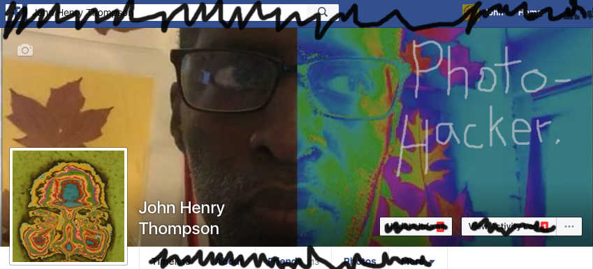
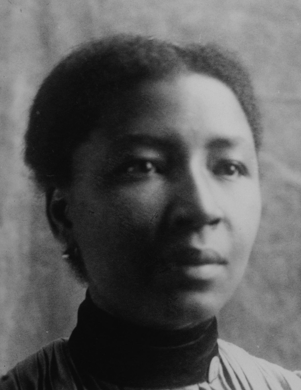
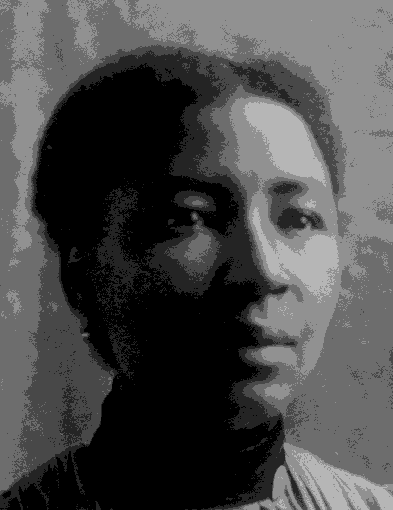
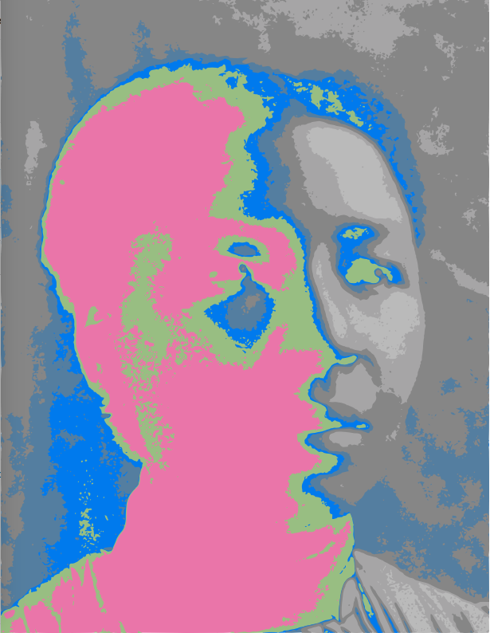
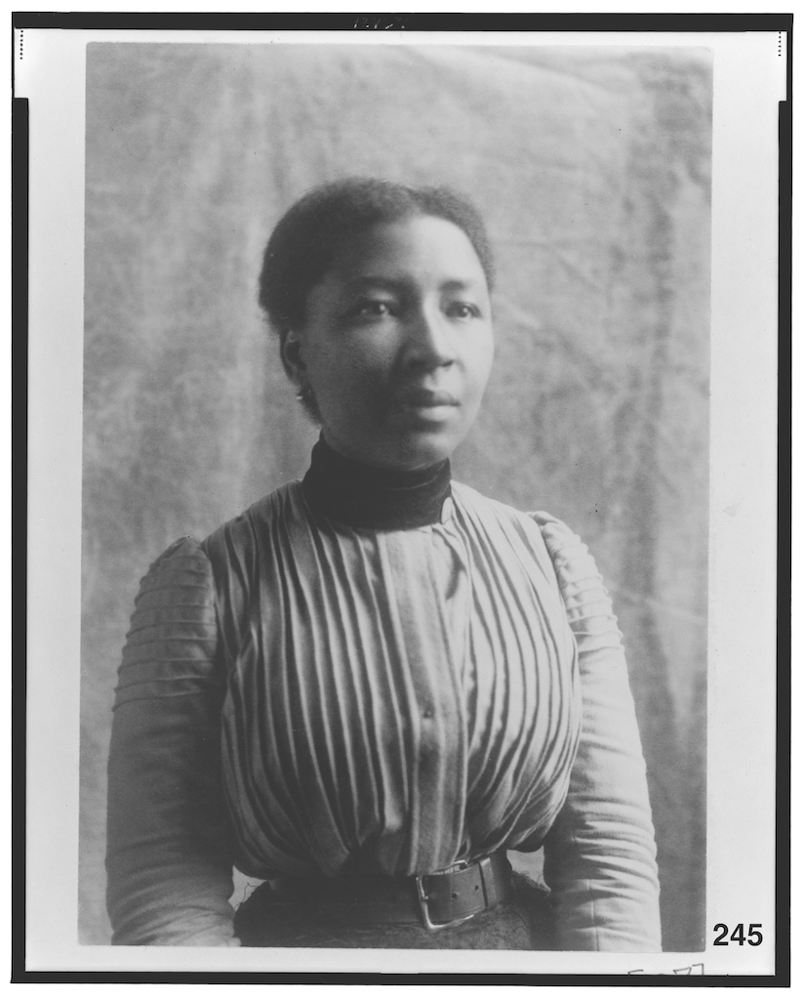
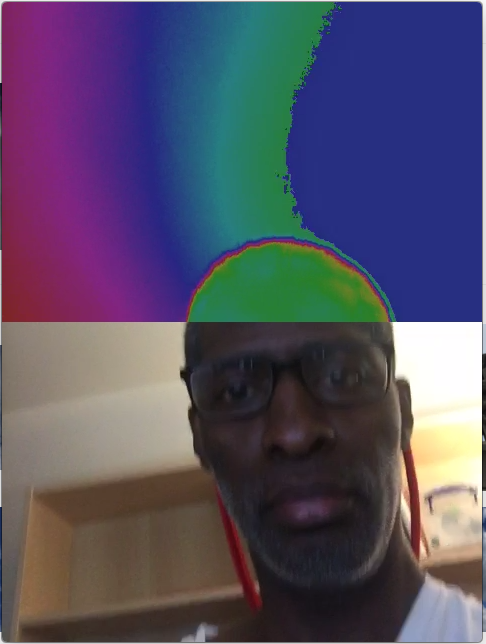
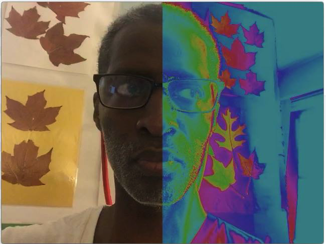

# photohacker
Learn from the hackers - take control of your photos. Use hacker tools to manipulate your photo library.

# Workshop at scribe.org, Apr 6 2017
## Creating and sharing photos using hacker tools
A hacker uses code to make the computer go beyond the ordinary. Get creative control over your photos using hacker tools. Using the latest free open source software tools, John Henry Thompson, will guide participants in the art of automated composition of photos to arrange photos into a collage and overlaying text on a set of photos to publish to the web. No coding experience required. Work with sample code provided by Thompson.

INSTRUCTOR: John Henry Thompson

4 Thursday Sessions 4:30 PM – 6:30 PM – April 6, April 13, April 20, April 27 –  

# Tools
- Terminal -- in Application/Utilities folder
- [github desktop](https://desktop.github.com)
- [atom text editor](https://atom.io)
- [nodejs](https://nodejs.org/en/download/)

# Documentation
- [jimp](https://www.npmjs.com/package/jimp)

[yinyang svg](a-/svg/15-svg-yinyang.html)

[colorwheel.js](https://github.com/ariya/phantomjs/blob/master/examples/colorwheel.js)

[African American woman](http://www.loc.gov/pictures/collection/anedub/item/99472067/)
[ - webdb 245](http://metadeepmix.com/webdb/webdb/)

[JHT](http://www.johnhenrythompson.com/home/bio)

